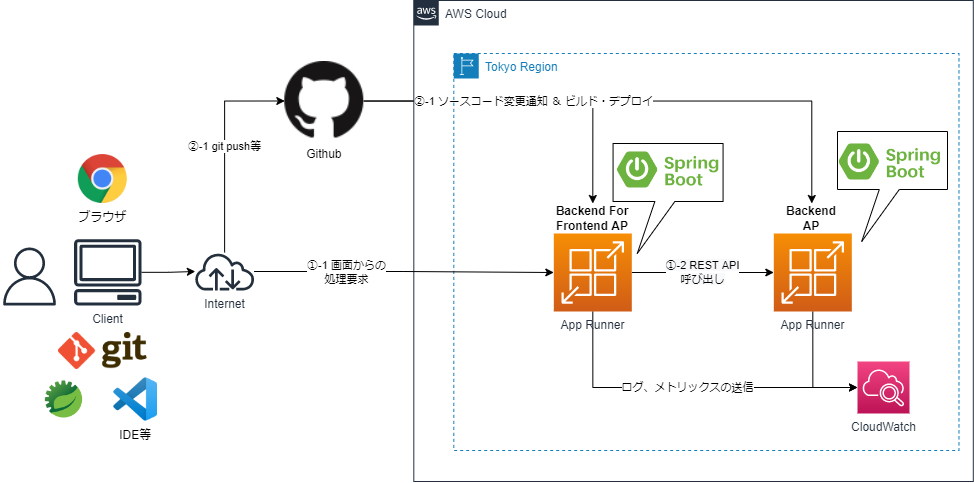

# SpringBoot APをGitHubとAppRunnerで動作させるCloudFormationサンプルテンプレート

## 構成
* システム構成図



* CI/CD、コンテナ起動はAppRunnerで実現
    * ソースコードをGitHubで管理し、git push等するとAppRunnerでビルド&デプロイ
        * AppRunnerがサポートするソースコードリポジトリは現状GitHubのみ
        * https://docs.aws.amazon.com/ja_jp/apprunner/latest/dg/architecture.html
* メトリックスのモニタリング
    * AppRunnerの機能で実現
        * https://docs.aws.amazon.com/ja_jp/apprunner/latest/dg/monitor-cw.html
* ログの転送
    * AppRunnerの機能でCloudWatch Logsへログ出力
        * https://docs.aws.amazon.com/ja_jp/apprunner/latest/dg/monitor-cwl.html
* オートスケーリング
    * AppRunnerの機能で実現
        * https://docs.aws.amazon.com/ja_jp/apprunner/latest/dg/manage-autoscaling.html
## 事前準備
* 別途、以下の2つのSpringBootAPのプロジェクトが以下のリポジトリ名でGitHubにある前提
  * backend-for-frontend
    * BFFのAP
    * backend-for-frontendという別のリポジトリに資材は格納
  * backend
    * BackendのAP
    * backendという別のリポジトリに資材は格納
* マネージドコンソール等科、AppRunnerの「GitHub接続」を作成しておく
    * https://docs.aws.amazon.com/ja_jp/apprunner/latest/dg/manage-connections.html    

## AppRunnerの作成
* Backend APの起動
```sh
aws cloudformation validate-template --template-body file://cfn-apprunner-backend.yaml

aws cloudformation create-stack --stack-name APPRUNNER-BG-Stack --template-body file://cfn-apprunner-backend.yaml ParameterKey=GitHubConnectionArn,ParameterValue=(GitHub接続のARN)ParameterKey=GitHubRepositoryUrl,ParameterValue=(GitHubのリポジトリのURL) 
#例
aws cloudformation create-stack --stack-name APPRUNNER-BG-Stack --template-body file://cfn-apprunner-backend.yaml --parameters ParameterKey=GitHubConnectionArn,ParameterValue=arn:aws:apprunner:ap-northeast-1:999999999999:connection/apprunner-example-connection/XXXXXXXXXXXXXXXXXXXXXXXXXXXXXXXX ParameterKey=GitHubRepositoryUrl,ParameterValue=https://github.com/xxxxx/backend
```

* BFF APの起動
```sh
aws cloudformation validate-template --template-body file://cfn-apprunner-bff.yaml
aws cloudformation create-stack --stack-name APPRUNNER-BFF-Stack --template-body  file://cfn-apprunner-bff.yaml ParameterKey=GitHubConnectionArn,ParameterValue=(GitHub接続のARN)ParameterKey=GitHubRepositoryUrl,ParameterValue=(GitHubのリポジトリのURL) 

#例
aws cloudformation create-stack --stack-name APPRUNNER-BFF-Stack --template-body  file://cfn-apprunner-bff.yaml 
 --parameters ParameterKey=GitHubConnectionArn,ParameterValue=arn:aws:apprunner:ap-northeast-1:999999999999:connection/apprunner-example-connection/XXXXXXXXXXXXXXXXXXXXXXXXXXXXXXXX ParameterKey=GitHubRepositoryUrl,ParameterValue=https://github.com/xxxxx/backend-for-frontend
```
